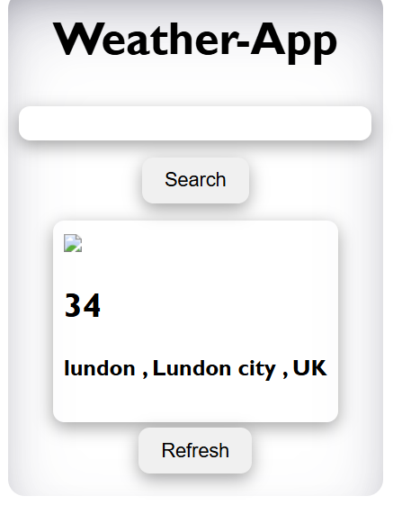

## Available Scripts

In the project directory, you can run:

### `npm start`

# Step of making Weather app

1. Go to the weather api and create a account and 
for testing this use option api explolor in b/w use your api key and , make arequest for fatch data ,
we get data in JSON from , here we get some link, by using 
this link we can fatch the same data 

2. ## make a simple react app ui

